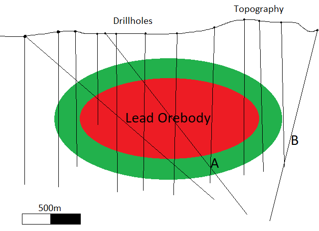

# Background

At Datarock's Broken Down lead deposit in rural Tasmania, resource drilling routinely acquires geochemical assays in all its [drill holes](https://en.wikipedia.org/wiki/Exploration_diamond_drilling). These assays give an indication of the metal abundances for each sample, which in turn helps us characterise the orebody and surrounding rockmass.

Recently, a geochemical consultant noticed that changes in the relative metal abundances could potentially be used to indicate proximity to the main orebody. Using a simple euclidean distance measure, she calculated the distance from each sample to the orebody wireframe (red) and then using that distance she classifies samples into two groups: A (proximal - Red/Green) and B (Distal - White).

*Figure 1: Expertly drawn diagram showing a cross section of the orebody, the classes and the drill holes*

# Aim:

- Can we use the same geochemical data and labels to generate a predictive model for future drill holes which can label samples on whether they are in class A or class B?
- More data has been acquired since the geochemist completed her work - can we predict labels onto these data points (labelled “?”).

# Data:

- 4472 unique geochemical assay samples
- Drill hole metadata included (uniqueID, holeid, from, to) - each one of these samples is derived from rock extracted from the ground which has been assayed to determine its chemical breakdown. Some not-required but additional information: ALS
- 8 assay elements - As, Au, Zn, Fe, S, Cu, Mo and Pb
- One class column with two labels - A, B. Approximately 800 samples have no labels and use ?.

*Note: Data has some QAQC issues including missing data and unsuitable detection limits (-999, characters).*

# Output:

- A presentation or document showing workflow used, QAQC, results and observations. To be presented and discussed at a later date.

*Note: No interpretation or knowledge of the geochemical inputs is expected or required.*

# Data Download :
The required data can be found [here](data/data_for_distribution.csv)
